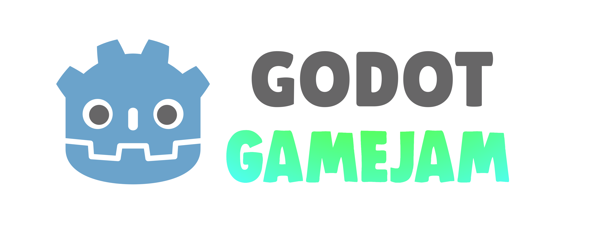

# Amargos y Pólvora

## Descripción
**Juego hecho en la jam Godot Meetup de abril 2025**

**¡El terror folclórico argentino cobra vida!**

En este frenético top-down shooter, te han convocado a un pueblo remoto para enfrentarte a las más terroríficas leyendas urbanas de Argentina. Armado solo con tu valentía, un mate amargo y un arsenal bendecido, tendrás que exorcizar a tiros a criaturas como el Pomberito, la Luz Mala, el Lobizón y muchas más.

¿Podrás sobrevivir a la noche y salvar tu cogote?

## Características

- **Combate intenso** estilo top-down shooter
- Enfrenta a legendarios **monstruos del folclore argentino**
- Múltiples armas para desatar el caos sagrado
- Explora escenarios inspirados en la geografía argentina
- Música y ambiente que te sumergirán en el terror criollo

## Controles

| Acción | Tecla |
|--------|-------|
| Movimiento | WASD |
| Disparar | Click del ratón |
| Recargar | R |
| Dash (Esquivar) | Shift |
| Cambiar armas | 1, 2 |

## Jugarlo online

También puedes jugar directamente en tu navegador visitando nuestra página en [itch.io](https://pandeneitor.itch.io/amargos-y-polvora)

---

¡Prepárate para enfrentar el lado oscuro de las leyendas argentinas con amargos y pólvora como únicos aliados! ¿Tendrás el coraje necesario para sobrevivir?

## Creditos
Angie Agüero Image Campus - Daniel Ignacio Amieva UTN - Mendoza Federico Moya UM - Laura Srur Image Campus - Mauro Castro UNSO - Natali Scrossopi UTN - Zoe Muruchi UM